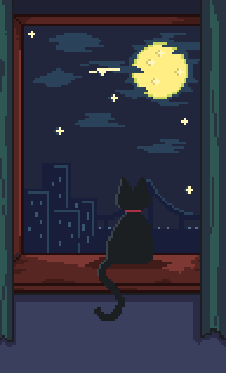

<table>
<tr>
<td width="60%">

# Hi, I'm Andri 👋

[](https://git.io/typing-svg)

### Andri Dwi Somantri

#### *Cleon Thadeas*

<br>

🌐 **Website**
https://andrixlab.me

💼 **LinkedIn**
https://linkedin.com/in/andridwisomantri

🐙 **GitHub**
https://github.com/CleonThadeas

<br>


</td>

<td width="40%">



</td>
</tr>
</table>

---

<details>
<summary><b>👨‍💻 About Me</b></summary>

<br>

```yaml
Name: Andri Dwi Somantri
Alias: Cleon Thadeas

Role:
  - Mobile Developer
  - Full Stack Developer

Interests:
  - Artificial Intelligence
  - Software Engineering
  - Product Development

Current Focus:
  - Flutter
  - Laravel
  - Golang
  - AI Integration
```

</details>

<details>
<summary><b>🚀 Projects I'm Building</b></summary>

<br>

### ♻️ OkGreen

Waste Management Platform

---

### 🤖 KairovaAI

AI Career Intelligence Platform

---

### 📦 TripleA Inventory

Inventory Management System

---

### 🕌 ImamKu

Islamic Companion Application

---

### 🌐 AndrixLab

Portfolio & Development Hub

</details>

<details>
<summary><b>💼 Professional Experience</b></summary>

<br>

### Mobile Developer

Poolapack

* Flutter Development
* API Integration
* UI Implementation
* Feature Development
* Application Maintenance

</details>

<details>
<summary><b>🛠 Tech Stack</b></summary>

<br>

<p align="center">


</p>

</details>

<details>
<summary><b>🏆 Achievements</b></summary>

<br>

* TARBAK UNIFEST Business Plan Winner
* Zurich Entrepreneurship Program
* Student Company Competition
* Job Shadow Program
* Virtual Reality Educourse

</details>

<details>
<summary><b>📈 Developer Journey</b></summary>

<br>

```text
SMKN 11 Bandung
        │
        ▼
Student Company
        │
        ▼
Business Competitions
        │
        ▼
Product Development
        │
        ▼
Mobile Developer
        │
        ▼
Building AndrixLab
```

</details>

<details>
<summary><b>📊 GitHub Analytics</b></summary>

<br>

<p align="center">


</p>

</details>

<details>
<summary><b>💭 Philosophy</b></summary>

<br>

> "Do your best so the results will follow."

<br>

> "Don't Give Up."

</details>
